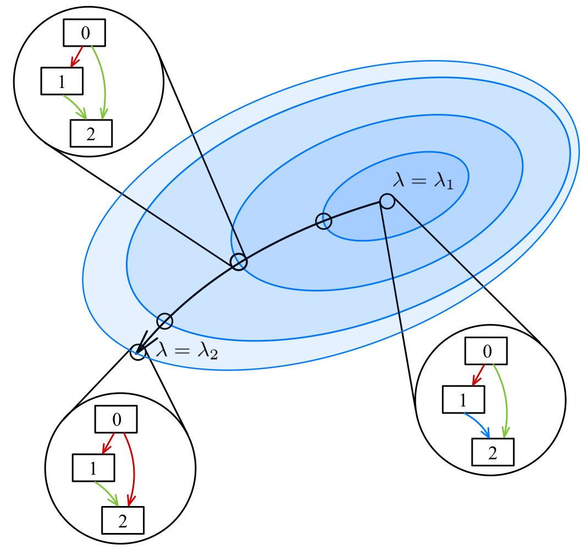

.. class:: center

    :Problem: Differentiable algorithm for searching ensembles of deep learning models with diversity control
    :Author: Peter Babkin
    :Scientific adviser: Bakhteev Oleg
    :Scientific consultant: Yakovlev Konstantin, Petrushina Ksenia

Abstract
========

This paper is developed to introduce a new method of creating ensembles of deep learning models. 
Many modern researches were focused on creating effective and efficient algorithms of differentiable architecture search,
missing oppotunity to create ensembles of less sophisticated deep learning models. This approach gives impressive results
as it was shown in few modern papers. In our research we investigate an algorithm of sampling deep learning models using
hypernetwork, which controls diversity of the models. Distinction between two models is measured in terms of Jensen–Shannon
divergence which keeps the algorythm differentiable. To evaluate the performance of the proposed algorithm, we conducted
experiments on the Fashion-MNIST and CIFAR-10 datasets and compare the resulting ensembles with ones sampled by other
searching algorithms.

Run experimnet
==============

To run basic code go to folder code and open main.ipynb.
All packages are available through simple installation:

``pip install -r requirements.txt``

Deep ensemble
=============

    Architectural space

    Olololo.

Links
=====
1. `Paper pdf <https://github.com/intsystems/2023-Project-120/blob/master/paper/main.pdf>`_.
2. `Link review <https://docs.google.com/document/d/1-P76pFjZ2E4BIjLVU8KY1NC7g1Qt-YFh6zX-V67FTUU/edit>`_.
3. `Overleaf for paper <https://www.overleaf.com/3228135464pjqvcbkvrgwb>`_.
4. `Overleaf for slides <https://www.overleaf.com/8856778119stvyckdjvffv>`_.
